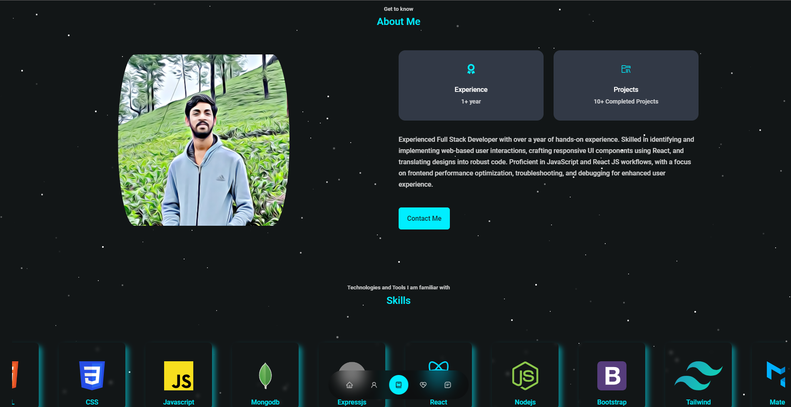

# Personal | Developer Portfolio

## Preview
<div align="center">
  
</div>

## About
This is a React-based Developer Portfolio that can be easily modified.

## Hosted Website
Check out the live version here [Personal Portfolio](https://josuk22.github.io/Portfolio/).

## Setup Instructions

### Prerequisites
Make sure you have the following installed on your local machine:
- Git
- Node.js
- npm or yarn

### Clone the Repository
To set up the project locally, follow these steps:

1. **Clone the repository**
    ```bash
    git clone https://github.com/JosuK22/Notes-App.git
    ```

2. **Navigate to the project directory**
    ```bash
    cd Notes-App
    ```

3. **Install dependencies**
    ```bash
    npm install
    # or
    yarn install
    ```

4. **Run the application**
    ```bash
    npm start
    # or
    yarn start
    ```

5. **Open the application**
    Open your browser and go to `http://localhost:3000` to view the NotesApp.

## Modifying the website
    You only need to modify the contents inside the data folder (src/data) and the images (src/assets/images).

## Hosting with GitHub Pages

To host your React NotesApp using GitHub Pages, follow these steps:

1. **Install the gh-pages package**
    ```bash
    npm install --save gh-pages
    # or
    yarn add gh-pages
    ```

2. **Add homepage to package.json**
    Add the following line to your `package.json` file:
    ```json
    "homepage": "https://Your-Github.github.io/Repository-name"
    ```

3. **Add deployment scripts to package.json**
    Update your `package.json` file to include the following scripts:
    ```json
    "scripts": {
      "predeploy": "npm run build",
      "deploy": "gh-pages -d build"
    }
    ```

4. **Deploy the application**
    ```bash
    npm run deploy
    # or
    yarn deploy
    ```

5. **Access your application**
    - Your NotesApp will be published at `https://User-Name.github.io/Repository-Name`.

## Hosting with Other Platforms

You can also host your React NotesApp using other platforms such as Netlify, Vercel, or Heroku. Here are the basic steps:

### Netlify
1. **Create a Netlify account**: Go to [Netlify](https://www.netlify.com) and sign up.
2. **New site from Git**: Click on "New site from Git" and connect your GitHub repository.
3. **Build settings**: Set the build command to `npm run build` and the publish directory to `build`.
4. **Deploy**: Click on "Deploy site" to publish your NotesApp.

### Vercel
1. **Create a Vercel account**: Go to [Vercel](https://vercel.com) and sign up.
2. **New Project**: Click on "New Project" and import your GitHub repository.
3. **Build settings**: Vercel automatically detects the build command and output directory for React apps.
4. **Deploy**: Click on "Deploy" to publish your NotesApp.

### Heroku
1. **Create a Heroku account**: Go to [Heroku](https://www.heroku.com) and sign up.
2. **Create a new app**: Click on "New" and then "Create new app".
3. **Deploy via GitHub**: Connect your GitHub repository to Heroku.
4. **Build settings**: Set the buildpack to `heroku/nodejs`.
5. **Deploy**: Click on "Deploy Branch" to publish your NotesApp.

## Contributing
If you have any suggestions or find any issues, please feel free to open an issue or submit a pull request.

## License
This project is licensed under the MIT License - see the [LICENSE](LICENSE) file for details.
